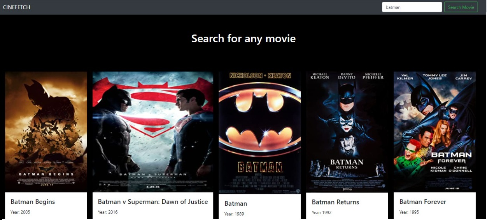

## Consumiendo API con Javascript

# Preview

# Comenzamos 🚀

Acá construí una aplicación de escritorio sencilla en la cual vamos a consumir información traída desde OMDBAPI.  
Hice uso de Axios para realizar las peticiones y utilizamos **Vue.JS** como framework de JavaScript.

Para usar esta API es necesario ir al apartadp **API Key**
http://www.omdbapi.com/apikey.aspx y colocar tu correo electronico.

# Instalaciones:

USING NPM:
``
npm install axios
``

CDN:
``

``

# Vue.js

https://vuejs.org/v2/guide/

CDN:

# Bootstrap

https://getbootstrap.com/

components/navbar

Como queremos buscar por titulos usamos la "s" es decir, /?s=